# Design: Constraint Execution and Design-Space Studies (Original Concept)

**Status:** Proposed
**Owner:** 1cFE
**Created:** 2026-07-10; revised 2026-07-11

---

> **Original concept document.** This captures the context, the problem, and the high-level shape of the solution. The definitive design — with the authoritative Core Model, invariants, spikes, and open decisions — is [`constraint-execution-and-design-space-studies-claude.md`](./constraint-execution-and-design-space-studies-claude.md). Where any detail below differs from that design, the design governs; read the sections here as the original framing, not the current specification.

---

## Overview

This design connects modeled engineering limits to executable forward models and then to repeatable design-space studies. Calculations compute one candidate design state. Constraints judge that state. A study varies candidate inputs, records every outcome, and applies user-selected feasibility and search policy.

The core insight is to preserve those as three separate responsibilities. The modeling layer owns meaning, the generated model owns deterministic evaluation, and the study layer owns exploration and decisions. This makes a violated physics limit visible without confusing it with broken code, and it lets manual, agent-led, grid, uncertainty, and optimization workflows use the same model evidence.

---

## Problem

The authoring workflow already helps engineers capture hardware structure, forward calculations, and physical limits. The calculation path survives generation and runs as a typed graph. The constraint path stops at a warning. Its predicate, bindings, concrete design context, and truth value never reach execution. Studies therefore copy important relations into scripts, where they can drift from the model.

The execution framework runs one file-oriented pipeline at a time. It has no stable model contract for varying parameters in memory, no candidate or study lifecycle, and no result record that separates infeasibility from execution failure. Existing sweeps work by calling generated functions directly and assembling their own classifications.

The missing system is not an equation solver. A forward model must already know how to calculate its outputs. It needs a trustworthy way to evaluate modeled predicates over those outputs, expose the evidence, and let an outer study decide whether a candidate is rejected, penalized, retained for a boundary plot, or sent back to a search strategy.

---

## Goals

- Make supported modeled assertions executable for each concrete design state.
- Preserve normal outputs and diagnostic evidence when a candidate violates an assertion.
- Let users and agents define variables, objectives, policies, and search methods without copying model equations.
- Support auditable single runs and high-throughput studies through one semantic model contract.

## Non-Goals

- Solve algebraic equations, infer missing values, or add implicit loops to the forward graph.
- Prove temporal invariants or monitor time-series behavior.
- Assign hard, soft, advisory, objective, or penalty roles from names or assertion syntax.
- Execute requirement satisfaction, assumptions, or preconditions in the first scope.
- Invent floating-point equality tolerances, universal margins, or normalized penalties.

---

## Design Principles

### 1. Compute, Judge, and Decide Are Different Operations

Calculations produce a design state. Constraints observe that state and return evidence. Study policy decides what the evidence means for the current exploration. A physics relation that determines a value belongs in a calculation; a relation that limits or checks values belongs in a constraint.

### 2. Execute the Effective Predicate in Concrete Context

An assertion may own its predicate inline or select a reusable predicate and supply bindings. Neither has runtime meaning without its owning design instance. Inheritance and templates may create several executions from one source assertion. Every result therefore belongs to one effective predicate in one concrete context.

### 3. Preserve Structure Until the Last Responsible Moment

Predicates, bindings, identities, and source facts remain typed structural data through extraction, snapshots, and graph construction. Python is generated from that structure. Reconstructed text, regular-expression resolution, and dynamic evaluation are not semantic interfaces.

### 4. Treat Violations as Evidence

A false supported predicate is a successful assertion evaluation, not an execution failure. Study policy decides whether that violation makes the candidate infeasible for a particular study. Exceptions are reserved for broken or incomplete evaluation. Studies keep violations and failures distinct.

---

## Architectural Bets

- Use one ordinary graph module per concrete constraint plus one report aggregator, with serializable predicate, catalog, and semantic-contract data owned by the computation graph. Seal that contract with generated artifacts only after package generation. This preserves provenance, normal DAG scheduling, and the graph-only generation boundary.
- Put generic repeated-evaluation machinery in TEAx, but keep SysML interpretation and concrete constraint lowering upstream.
- Evaluate every supported assertion in the generated graph. Study choices remain a separate user-owned definition and never alter stored assertion results.
- Add typed in-memory input injection to TEAx as the first study capability; file-backed execution remains the auditable artifact path.

---

## Core Model

### Neutral Constraint Facts — agentic-mbse

`ExpressionIR` is a structural, serializable expression representation owned by agentic-mbse; a predicate is an expression whose result type is Boolean. How it relates to the existing expression representations — extend them, extract-and-migrate, or a predicate-focused tree with a convergence path — is a spike decision, not settled here; refer to the design. `ConstraintDefinitionFact` owns a reusable predicate and formal parameters. `ConstraintUsageFact` either owns an inline predicate or selects a definition, supplies actual expressions when needed, and preserves membership kind, assertion polarity, ownership, and inheritance facts. These language facts contain no Python names, graph channels, study policy, or TEAx types.

The executable modeling profile covers static scalar `AssertConstraintUsage`: inline predicates with owner-scope references and typed usages whose formals have explicit actuals or modeled defaults, including negation and basic Boolean composition. Plain, require, assume, and satisfy forms remain cataloged but unassessed. Temporal, invocation, or other unsupported constructs on an assertion block generation. The profile admits dimensionless or identically-united operands and performs no implicit unit conversion. It blocks real-valued equality in the first scope — no modeled-tolerance convention exists yet, and inventing one is a non-goal — while typed non-real equality is admitted only on proven type compatibility. Refer to the design for the full equality and unit rules. Design/prototype review and codegen preflight both run it.

### Concrete Constraint — sysml-codegen

`ConcreteConstraint` is one effective predicate in one owner instance. It combines source facts, resolved actuals, expected Boolean value, deterministic ID, and optional simple-inequality response metadata. Codegen expands it in a new lowering phase that reuses the virtual-usage idiom — run after aliases, the output registry, and supplied values are final and before dependency backtracking, because actual resolution needs the finished registry. (This is a new phase, not the earlier template-expansion pattern relocated.) Calculation-definition-owned assertions expand per concrete calculation usage. Refer to the design for the exact seam.

Constraint actuals use the typed output registry and `BindingResolution` result shape under a strict policy. A missing explicit actual is valid only when its formal has a modeled default; it becomes a named contract parameter carrying that default, so a study may vary it explicitly. Every other unresolved actual fails instead of becoming a synthesized entry point, and no constraint-specific text resolver exists. Every concrete constraint is a dependency root, so a calculation used only by an assertion remains reachable. Serializable `ExpressionIR` deliberately crosses snapshots and graph construction; raw modeling-tool objects do not.

`PipelineModule.module_kind` distinguishes calculations, formulas, aggregations, constraints, and the report aggregator. Structured output schema identity is graph data, not inferred from the old Boolean flags or discarded by float-specialized templates.

### Constraint Catalog and Evaluation

The graph embeds one `ConstraintCatalog` keyed by `constraint_id`: effective predicate source, concrete owner, semantic kind, polarity, source location, display expression, execution eligibility, and optional response metadata. `ModelContract` references this same catalog; it never generates a second copy.

Each generated constraint module emits a compact `ConstraintEvaluation`: ID, actual Boolean or unknown, `satisfied | violated | indeterminate`, optional signed margin, and a bounded diagnostic. The module does not repeat catalog metadata and never throws merely because the predicate is false.

`ConstraintReport` contains the catalog fingerprint, assessed coverage, deterministic results, and `violations | indeterminate | all_satisfied | not_assessed`. Any violation wins; otherwise any indeterminate result wins; otherwise one or more satisfied assertions gives `all_satisfied`; zero assertions gives `not_assessed`. All executable assertions always run. Non-executable kinds remain visible in catalog coverage and cannot be mistaken for assessed assertions. The aggregator has a generated exact input schema with one bound field per concrete assertion and is an ancestor of the exit point.

### Semantic and Executable Contracts — sysml-codegen

`ModelContract` is derived solely from graph fields. It catalogs stable parameter and output IDs, the one constraint catalog, evaluator capabilities, and a semantic fingerprint covering model/snapshot data, graph structure, and graph-declared schemas. After generated and preserved artifacts are finalized, `PackageContract` seals the model contract with their content hashes, generator version, and relevant TEAx version to produce the executable fingerprint. Study tools use the sealed contract rather than Python module names or YAML channels.

The generated package supplies a TEAx registry, every generated schema, pipeline, sealed package contract, and `ModelEvaluator` adapter. The adapter returns TEAx-owned immutable `ModelEvidence`: stable output/response IDs, values, full model artifacts, and provenance. Its first backend uses a cached validated graph plus the new typed in-memory EntryPoint boundary and optional persistence; the ordinary file path remains available for artifact-producing runs. A faster backend may follow only when it executes the same graph semantics and passes case-level parity.

### Study Definition and Runner — TEAx

`StudyDefinition` selects variables and domains from parameter IDs, observables from output IDs, objectives, response roles, failure policy, strategy, budget, and retention policy. It may be written by a person or agent. It cannot redefine a model predicate.

`CandidateStrategy` implements propose/observe. Prepared lists, manual or agent proposals, grids, random and uncertainty sampling, and optimizers share this interface. `StudyRunner` follows one order: validate candidate, evaluate model, assess immutable evidence, atomically commit the case, then advance the feedback cursor and strategy.

`CaseRecord` separates `invalid_candidate`, `completed`, `execution_failed`, and `assessment_failed`. Completed cases carry inputs, retained `ModelEvidence`, policy assessment, and timings; assessment failure preserves the same raw evidence without a successful assessment. `StudyStore` is append-only and idempotent by candidate ID. A strategy must be replayable from ordered feedback plus a seed, atomically checkpointed with its feedback cursor, or declared non-resumable. Fingerprint changes require a new study lineage.

---

## Diagram

```mermaid
flowchart LR
    A[Intent, sources, architecture] --> B[SysML calculations and constraints]
    B --> C[agentic-mbse semantic facts and validation]
    C --> D[sysml-codegen concrete graph and model contract]
    D --> E[Generated calculations]
    D --> F[Generated constraint evaluators]
    E --> F
    F --> G[Constraint report aggregator]
    E --> H[Model outputs]
    G --> I[TEAx model evaluator]
    H --> I
    J[Candidate strategy] --> K[Study runner]
    K --> I
    I --> L[Immutable model evidence]
    L --> M[Study policy]
    M --> N[Atomic case record and store]
    N --> J
```

---

## Required Invariants

### Semantic and Identity

- One `constraint_id` identifies exactly one effective predicate source, usage, concrete owner instance, and polarity within an executable fingerprint.
- Usage-owned and definition-owned predicates, negation, membership kind, and concrete source identity survive live extraction, snapshot generation, and execution unchanged.
- Every asserted predicate is executable or blocks generation with its identity and exact structural cause; other semantic kinds remain explicitly cataloged as unassessed.
- An expected concrete instance that cannot be formed is a deliberate validation error, stronger than today's warn-and-drop behavior.

### Graph and Evaluation

- Predicate, catalog, schema, and contract inputs are serializable graph data; generation never reaches sideways into extraction state.
- Constraint inputs reuse typed registry results with strict unresolved failure; they add no constraint-specific textual or entry-point fallback.
- Every concrete assertion and its upstream producers are ancestors of the report aggregator and exit point.
- A false predicate returns `violated`; it does not raise or suppress ordinary outputs.
- Explicit non-finite operands produce `indeterminate`; missing inputs, schema failures, thrown predicate code, or missing aggregator fields produce `execution_failed`.
- A margin exists only when the predicate structure gives it an unambiguous sign. Compound predicates do not receive an invented aggregate margin.
- Generated modules validate values inside `run()`, producer/consumer types match exactly, and all constraint/report schemas are registered.
- Catalog and evaluation ordering are deterministic across live and snapshot generation.

### Study Execution

- Invalid proposal, model execution failure, completed assertion evidence, and assessment failure remain distinct case states.
- Study policy may classify or penalize evidence but may not change stored model results.
- Auditable and fast evaluators return equivalent selected outputs and constraint results for the same canonical inputs.
- Atomic case commit precedes replayable strategy feedback; persistence/infrastructure failure never creates a completed case.
- Candidate IDs plus executable and study fingerprints make resume idempotent and prevent mixed-model datasets.

---

## How It Works

### Author and Compile a Forward Model

An engineer or agent models value-producing physics as calculations and physical limits as inline or reusable assertions. The executable profile runs while prototyping and again at codegen preflight. Codegen expands assertions through concrete part and calculation usages, resolves actuals, makes them graph roots, emits explicitly typed modules and the aggregator, and publishes the graph-derived model contract.

### Evaluate One Design Point

The new TEAx evaluator accepts typed values keyed by contract parameter IDs and injects them through a supported in-memory EntryPoint boundary. TEAx validates graph bindings; each generated module validates runtime values. Constraint nodes consume entry values and upstream outputs, and the aggregator emits one assertion report beside normal outputs. A file-backed option persists an auditable run once the in-flight scalar ExitPoint persistence work is finished, audited, and merged.

### Run a Search or Sweep

The runner asks the selected strategy for candidates. Invalid proposals are recorded without model execution. For valid points it preserves model evidence, applies policy, atomically records both, then advances feedback. Policy may reject a point while retaining outputs and violations for plots and diagnostics. Model, assessment, or persistence failures remain phase-distinct.

### Inspect and Resume

Users inspect results by parameter, output, constraint ID, assertion status, and study assessment. Static source details join through the catalog. Resume refuses changed executable or study fingerprints and restores strategy state by deterministic replay or checkpoint; a non-resumable strategy says so before starting.

---

## Edge Cases and Failure Modes

- A constraint is the only consumer of a calculation: treating the constraint as a root retains the producer in targeted generation.
- An inherited assertion appears on several part instances: codegen emits one deterministic concrete ID and result per instance.
- An asserted predicate uses unsupported invocation, conditional, temporal, or unit semantics: the executable profile names the construct and blocks generation; plain, require, assume, and satisfy forms remain visible but unassessed.
- A calculation or predicate module raises, or the aggregator misses an input: the case is `execution_failed`; partial channels make no completed assertion claim.
- An explicitly present operand is NaN or infinite: the affected assertion is indeterminate, and study policy decides whether to accept the point.
- A model has no assertions: the report is `not_assessed`; documented-only constraints never create a false `all_satisfied` result.
- A study has thousands of cases: selected values live in case records while source metadata lives once in the catalog; per-case file output can be disabled.
- A very large assertion fan-in makes generated aggregator schemas expensive: measure the generated contract and revisit module fusion only beyond an explicit scaling limit.
- Objective extraction or policy assessment fails: preserve completed model evidence in an `assessment_failed` record; never relabel it as model failure.
- Output or store persistence fails: leave no completed case, retain a retryable phase-tagged event, and replay from the last atomic commit.
- A model, preserved implementation, generator, or runtime changes during a study: executable fingerprint mismatch starts a new lineage.

---

## Vocabulary

- `forward model`: a directed computation from fully supplied inputs to outputs; it does not solve unspecified variables.
- `constraint definition`: a reusable Boolean predicate with formal parameters.
- `constraint usage`: an application that owns or selects an effective predicate in semantic context and supplies bindings when the predicate has formals.
- `concrete constraint`: one executable usage in one concrete owner instance.
- `model contract`: the graph-derived semantic catalog of parameters, outputs, constraints, schemas, and evaluator capabilities; its sealed `package contract` adds exact executable artifact and tool-version hashes.
- `constraint report`: assertion evidence and assessment coverage for one design point; it does not decide study feasibility.
- `study policy`: user-selected interpretation of outputs and constraint evidence for one exploration.

---

## Validation Strategy

- Use live modeling-tool probes to pin predicate ownership, membership, negation, inheritance, bindings, and the shared expression-tree shapes.
- Add neutral-fact fixtures and executable-profile tests in agentic-mbse, including exact unsupported diagnostics.
- Add graph-schema, module-kind, compiler, instance-expansion, strict-resolution, reachability, fingerprint, and live/snapshot parity tests in sysml-codegen.
- Add TEAx tests for typed input injection, module self-validation, type continuity, report precedence, phase-distinct failures, atomic commit, and strategy replay.
- Replace the IFE sweep's copied viability formula with the generated assertion and compare every existing grid classification.

---

## Next-Stage Handoff

**Settled here:**
- Calculations compute, constraints judge, and studies decide.
- Concrete constraint modules plus a report aggregator are the execution shape.
- The graph owns one static catalog and semantic contract; package generation seals it for execution, while dynamic assertion reports remain separate from study assessment.
- Violations are data; execution failures are failures.
- First scope is inline or typed static scalar assertions, including negation, owner-scope references or explicit actuals, and basic Boolean composition.

**Spec/design detail still needed next:**
- Exact neutral and graph schemas, deterministic ID encoding, snapshot version, generated module kinds, and package APIs.
- The executable operator/type/unit matrix and diagnostic taxonomy.
- TEAx typed-input evaluator, scalar persistence prerequisite, study/policy/store APIs, failure events, provenance, and CLI contracts.
- Migration of warnings, manifests, tests, authoring commands/skills/templates, and contradictory constraint guidance.

**First risk to de-risk:**
- Run the S1 learning test and S2 spike (see the design's Appendix B) to freeze the SysIDE fact shapes and shared expression tree before fixing cross-repo schemas.

---

## Summary

The system should treat modeled assertions as traceable responses of a generated forward model, not as exceptions or hidden solver instructions. A graph-owned contract then lets TEAx run one point or many while keeping assertion evidence, study feasibility, invalid proposals, and execution failure separate.

---

## Appendix A: What Exists Today

### The warning is a generation-time diagnostic, not a runtime verdict

There are two independent warnings today:

| Surface | Trigger | User-visible behavior | What survives |
|---|---|---|---|
| `agentic-mbse validate --level=6` | A plain or asserted constraint usage is present | One non-blocking `L6_CONSTRAINT_NON_EXECUTABLE` issue per usage; validation still passes | Nothing is handed to codegen by this check |
| `sysml-codegen generate` | Live extraction or snapshot replay sees a droppable constraint | One INFO per constraint and one summary WARNING | A `ConstraintManifestEntry` diagnostic row in `PipelineContext` and snapshot `dropped_constraints` |
| TEAx execution | A previously generated package is run | No warning and no constraint result | Only ordinary calculation outputs selected by the ExitPoint |

The codegen manifest has owner kind, owner name and qualified name, constraint name, coarse kind, and source line. It has no definition identity, predicate, formal parameters, actual bindings, negation, concrete instance, graph dependency, or result channel. Dependency backtracking and graph construction never consume it. A model whose assertion would be false therefore executes exactly like the same model with no assertion: TEAx calculates normal outputs and has no fact from which to report satisfaction or violation.

This changed recently enough to explain conflicting historical notes. WI-014 observed a silent drop on 2026-07-05. The current checkout now reports the drop during validation/generation, but execution is still absent.

### Existing building blocks

| Existing type or service | What it already provides | Missing piece |
|---|---|---|
| `ExpressionRef` and expression helpers in agentic-mbse | SysIDE traversal, references, display reconstruction, feature-chain segments | No serializable general expression tree |
| `ExpressionAST` in sysml-codegen | Proven recursive arithmetic IR and Python compilation | Ephemeral, codegen-local, calculation-local reference roles, no comparisons/Boolean nodes |
| `CalculationDefinitionData` | Reusable calculation signature and body facts | Constraint semantics |
| `CalcUsageData` | Definition link, actual bindings, owner, stable qualified instance | Constraint membership, expected truth, inline predicate |
| Virtual calculation expansion | One concrete calculation usage per part instance, including retyping/collision rules | Equivalent constraint expansion |
| `OutputRegistry` and `BindingResolution` | Typed, scoped channel resolution | Constraint actuals are not submitted to it |
| `ComputationGraph` and `PipelineModule` | Graph-only generation boundary and typed channel declarations | Module kind, structured schema identity, constraints/catalog/contracts |
| TEAx `PipelineGraph` and `SerialPipelineExecutor` | Validated DAG, fresh execution context, ordinary typed module scheduling | Typed in-memory EntryPoint source and normalized evaluation boundary |
| TEAx `RunResult` | Selected outputs, manifest, module versions, basic provenance | Model contract, constraint evidence, phase-classified failure, case identity |

None of `ExpressionIR`, `ConstraintDefinitionFact`, `ConstraintUsageFact`, `ConcreteConstraint`, `ConstraintCatalog`, `ConstraintEvaluation`, `ConstraintReport`, `ModelContract`, `PackageContract`, `ModelEvaluator`, `ModelEvidence`, `StudyDefinition`, `CandidateStrategy`, `StudyRunner`, `CaseRecord`, or `StudyStore` exists today.

Current code anchors: live collection and kind classification are in `src/sysml_codegen/extraction/extractor.py:98-181`; warning rendering is in `src/sysml_codegen/extraction/constraint_report.py:89-131`; orchestration calls it at `src/sysml_codegen/orchestration/pipeline_builder.py:741-744`; graph assembly starts from calculation usages at `src/sysml_codegen/resolution/graph_builder.py:237`; virtual calculation expansion is in `src/sysml_codegen/extraction/usage_extractor.py:372-526`; and the arithmetic IR/compiler is in `src/sysml_codegen/extraction/expression_compiler.py:38-243`. In agentic-mbse, the L4 placeholder is at `../agentic-mbse/src/agentic_mbse/validation/level4_constraints.py:44-80` and the L6 warning at `../agentic-mbse/src/agentic_mbse/validation/level6_architecture.py:595-642`. In TEAx, file-backed EntryPoint loading and ordinary module execution are in `../teax/packages/teax-simkit/simkit/core/pipeline_executor.py:104-231`, while the public single-run facade is `../teax/packages/teax-simkit/simkit/core/pipeline.py:137-212`.

## Appendix B: Detailed Component Design

### Definition, usage, and concrete execution

The proposal mirrors calculations but does not force inline constraints into a fake definition:

| Constraint layer | Calculation analogue | Responsibility |
|---|---|---|
| `ConstraintDefinitionFact` | `CalculationDefinitionData` | Reusable semantic identity, formal parameters/defaults, Boolean `ExpressionIR`, source |
| `ConstraintUsageFact` | `CalcUsageData` | Modeled application, owner, optional definition reference, optional inline predicate, actual expressions, membership kind, expected truth |
| `ConcreteConstraint` | Expanded/virtual `CalcUsageData` plus its `PipelineModule` | One owner-instance execution with every reference resolved to a channel or legitimate contract parameter |

For a typed usage, the definition owns the predicate and formals while the usage owns actual expressions. WI-014's reusable `Cost Within Budget` owns `cost <= budget`; `affordable` binds those formals to `cost_calc.cost` and `plant_budget`. For an inline usage, the usage owns the predicate and directly references its containing context. SysIDE points such a usage at the generic library `ConstraintCheck`; that generic typing is not treated as the effective user definition.

`ConstraintUsageFact` must satisfy exactly one predicate-source rule: it has either a user definition reference or an inline expression. Assertion membership owns the expected truth. A normal assertion expects true; a negated assertion expects false. Ordinary, require, assume, requirement, and satisfy kinds remain distinct semantic catalog entries even when the first executable profile supports only assertions.

### Shared expression contract

`ExpressionIR` belongs in agentic-mbse beside the existing expression and aggregation helpers. Its neutral node algebra covers literal, feature reference, unary operator, binary/n-ary operator, invocation, unit annotation, and unsupported nodes with structural diagnostics. References preserve source name, qualified target when SysIDE provides it, and feature-chain segments. They do not classify a value as a Python input, graph channel, or intermediate.

The first executable profile accepts numeric/Boolean literals, owner or formal references, arithmetic needed inside predicates, comparisons, `and`, `or`, and `not`. Invocation, temporal behavior, unsupported units, and equality without modeled tolerance remain representable but fail the executable profile. Codegen maps resolved references onto runtime inputs and compiles the neutral tree to Python. The current calculation compiler should delegate common AST classification to this tree over time; it should not create a second predicate-only IR.

The existing generic binding helper is not adopted unchanged. A live WI-014 probe showed that its legacy membership walk expanded `cost_calc.cost` into an inherited-feature path. The newer feature-chain segment helper returned the correct two-segment path. Constraint actual extraction factors the newer primitive.

### Cross-repository ownership map

| Repository/package area | Proposed component | Relation to current code |
|---|---|---|
| `agentic_mbse.sysml.expression_ir` | `ExpressionIR`, raw-SysIDE builder, serialization | Generalizes the current expression traversal and the neutral-tree pattern used by aggregation |
| `agentic_mbse.sysml.constraint` | `ConstraintDefinitionFact`, `ConstraintUsageFact`, effective-predicate extraction | Replaces name-only enumeration as the semantic source; current droppability remains compatibility policy |
| `agentic_mbse.validation` | Executable constraint profile | Replaces L4 placeholder coverage and L6 blanket drop warnings with exact eligibility diagnostics |
| `sysml_codegen.orchestration` | Constraint assembly phase | Receives facts during live extraction/snapshot load, then invokes expansion/resolution at the correct pipeline seam |
| `sysml_codegen.resolution.constraint_lowering` | Instance expansion, actual resolution, deterministic IDs, required channels | Mirrors virtual calculation and part-definition EXPOSE/aggregation expansion; reuses registry resolution |
| `sysml_codegen.analysis.DependencyBacktracker` | Additional required-channel roots | Retains producers used only by constraints before targeted pruning |
| `sysml_codegen.resolution.models` | `ModuleKind`, structured schema identity, constraint/catalog/contract graph fields | Deliberate graph-schema revision; generation remains graph-only |
| `sysml_codegen.generation` | Generic structured wrappers, constraint modules, exact report aggregator, contracts, generated evaluator adapter | Extends current schema/module/registry/YAML generators rather than adding a sidecar runtime |
| `simkit.core` in TEAx | `EntrySource`, `PreparedPipeline`, `ModelEvidence`, normalized evaluation error, evaluator protocol | Refactors hard-coded file loading while retaining `SerialPipelineExecutor` and fresh contexts |
| `simkit.study` in TEAx | Study models, strategies, policy, sequential runner, SQLite store | New layer anticipated by the original meta-analysis design; depends only on evaluator protocol |

### Compile-time data flow

1. Live loading calls agentic-mbse once to collect definition and usage facts. Snapshot capture serializes those neutral facts and `ExpressionIR`; it never serializes SysIDE objects.
2. Existing calculation usage and hierarchy extraction constructs the concrete part/calc instance index, applies retyping, and materializes supplied values.
3. After aliases and the output registry are final, constraint lowering expands assertions owned by part or calculation definitions per concrete instance. Assertions already owned by a concrete part usage remain one instance.
4. Each actual expression is resolved through the existing scoped registry. A missing actual with a modeled formal default becomes a named contract parameter with that default. Any other unresolved reference is a generation error.
5. Resolved constraint input channels become additional dependency roots before backtracking prunes the graph.
6. Graph assembly adds one structured-output module per executable assertion and one exact-input report aggregator. The aggregator exists even for zero assertions and returns `not_assessed`.
7. Generation reads only graph data. It emits schemas, modules, registry, YAML, static catalog, graph-derived `ModelContract`, and a generated evaluator adapter. A final package-sealing pass hashes the declared generated/preserved artifact set into `PackageContract` without hashing the seal itself.

### Runtime and study data flow

1. TEAx prepares the pipeline once: parse specification, validate modules/channels/types, and build `PipelineGraph`.
2. Each evaluation creates a fresh `PipelineExecutionContext`. `ArtifactEntrySource` preserves today's file path; `MappingEntrySource` validates complete typed channel values without disk I/O.
3. Constraint modules run as ordinary modules. False predicates return `ConstraintEvaluation(status="violated")`; exceptions remain execution failures.
4. The report aggregator produces the one model-owned `ConstraintReport`. The generated evaluator maps stable contract parameter/output IDs to and from TEAx channels, projects constraint results into language-neutral response evidence, retains the full report as a model artifact, and returns immutable `ModelEvidence`.
5. `StudyRunner` validates a proposed candidate, evaluates it, passes immutable evidence to `StudyPolicy`, atomically commits a `CaseRecord`, and only then advances strategy feedback.
6. The first strategies are prepared lists and grids. Adaptive `propose/observe`, parallel execution, and alternate fast backends wait until parity and resume are proven.

### TEAx types are deliberately staged

All study types are new. The smallest credible sequence is:

1. Finish/audit scalar ExitPoint persistence and add ordinary producer-to-consumer type-continuity validation.
2. Add `EntrySource` and `PreparedPipeline`; cache validation/topology, never execution state.
3. Define the small `ModelEvaluator` protocol and immutable `ModelEvidence` envelope. The generated package supplies the concrete adapter and model/package contracts.
4. Add `StudyDefinition`, `PreparedCandidatesStrategy`, `GridStrategy`, `StudyPolicy`, sequential `StudyRunner`, phase-distinct `CaseRecord`, and transactional SQLite `StudyStore`.
5. Add adaptive strategies, checkpoints, parallel reservation, and faster backends only after case parity and crash-resume tests pass.

SQLite is the first store because atomic transactions, uniqueness constraints, and restart queries are required behavior, not optional scale features. A collection of output directories cannot safely implement candidate idempotency and feedback cursors.

## Appendix C: De-risking Spikes

The de-risking spike plan is specified authoritatively in the design (see its Appendix B, spikes S1–S7). The earlier S1–S5 sketch that lived here is superseded — refer to the design.

## Appendix D: Evidence Base

- `.project/research/20260710-095634_constraint-execution-and-design-space-exploration.md` — primary constraint-execution research and alternatives.
- `docs/architecture/modeling-assumptions.md` — current codegen modeling contract and explicit non-execution boundary.
- `../agentic-mbse/docs/patterns/constraints.md` — current authoring semantics and warning UX.
- `../agentic-mbse/docs/subtype-enumeration-decision-table.md` — subtype and membership limitations.
- `../agentic-mbse/docs/sysmlv2/SysML_Spec_v2_Part1/full_document.md` §7.20 — normative definition, usage, satisfaction, assertion, and negation semantics.
- `../fusion-tea/work/completed/20260705_WI-014_sysml-wiring-construct-validation/findings.md` — live predicate-evaluation and definition/usage findings.
- `../fusion-tea/modeling_project/HYPOTHESIS_DOSSIER.md` — end-to-end program intent and demonstrated DSE gap.
- `../teax/tea_simulation_design_doc.md` — original single-simulation and meta-analysis layering intent.
- OpenMDAO [constraint response](https://openmdao.org/newdocs/versions/latest/features/core_features/adding_desvars_cons_objs/adding_constraint.html), [driver](https://openmdao.org/newdocs/versions/latest/_modules/openmdao/core/driver.html), and [DOE](https://openmdao.org/newdocs/versions/latest/features/building_blocks/drivers/doe_driver.html) documentation — comparison for separating model responses, driver policy, and recorded cases.
